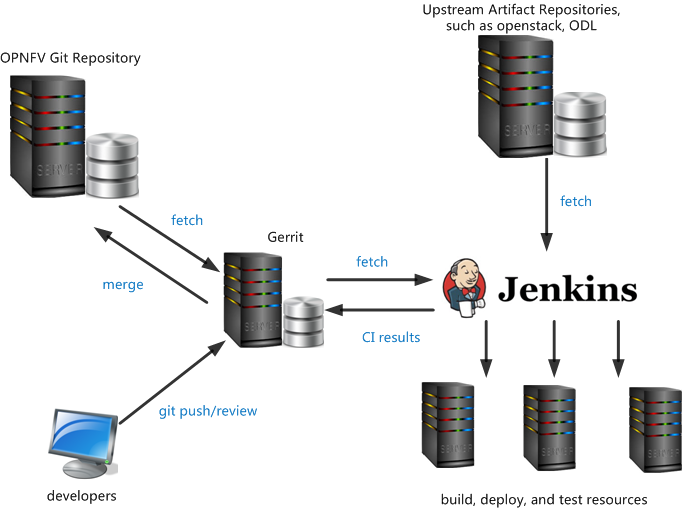

===========================================
OPNFV Continuous Integration Infrastructure
===========================================

This document covers the Continuous Integration(CI) infrastructure used in the day to day operation of the OPNFV,
which may be of interest to people who want to help develop this infrastructure or integrate their tools into it.

Infra-overview
===============

The OPNFV CI infrastructure includes hardware/tools to check, build, deploy and test, etc, in pipeline.
Below diagram shows the hardware/tools resources used in Octopus project,

The table below lists the tools/resources that are used in OPNFV CI,

+-----------------------------+-----------------------+
|	Tools/Resources       |         Name          |
+=============================+=======================+
|      CI Engine              |        Jenkins        |
+-----------------------------+-----------------------+
| Source Code Management(SCM) |          Git          |
+-----------------------------+-----------------------+
|     Code Review             |        Gerrit         |
+-----------------------------+-----------------------+
|  Artifact Repository        |     Google Storage    |
+-----------------------------+-----------------------+
|  Hardware Resources         | servers supplied by LF|
+-----------------------------+-----------------------+

The hardware resources are located in Linux Foundation(LF) lab and community labs,
for more details, please read the Pharos project,
which is shown in https://wiki.opnfv.org/pharos, a guide is provided to describe how to connect your hosting to LF Jenkins,
shown in https://wiki.opnfv.org/octopus/jenkins_slave_connection.

Major Infrastructures
======================

Git/Gerrit
-----------

Git is the famous open source distributed version control software,
it was initially designed and developed for Linux Kernel development,
and has become the most widely adopted version control system for software development.
Git puts emphasis on speed, data integrity, and support for distributed, non-linear workflows.

Jenkins git plugin is used as the Source Code Manager(SCM), in some way,
the Git features make it stand out apart from nearly every other SCM, for more details,
please refer to http://git-scm.com/about/. For developers, you can refer to http://git-scm.com/docs for its usage.

Gerrit is used here for facilitating online code reviews for our git version control system.
As a reviewer, you can see the changes are shown in a side-by-side style and add some inline comments.

Jenkins and JJB
----------------

Jenkins is a Continuous Integration system that runs tests and automates some parts of project operations.
Jenkins mainly focuses on building/testing software projects continuously and monitoring
executions of externally-run jobs. Upstream documentation is available at https://jenkins-ci.org/.

Jenkins supports plugins, which allows to be extended to meet specific requirements.
Numbers of plugins have been installed, and new ones can be installed when requirements arise.

The Jenkins jobs are defined by Jenkins Job Builder(JJB) in human readable YAML format.
The jobs defined are the key points of CI pipeline.
To make clear how the jobs in pipeline run to complete the build, deploy, test works,
you can refer to https://wiki.opnfv.org/octopus/pipelines.
Moreover, to start your own job in Jenkins,
you can write a JJB under the guide of https://wiki.opnfv.org/octopus/jenkins_wow.

Artifact Repository
-------------------

An artifact repository is a collection of binary software artifacts
and metadata stored in a defined directory structure,
it is a kin to what subversion is to source code, i.e.,
it is a way of versioning artifacts produced by build systems, CI, and so on.
At this moment, since there is not enough storage space of LF environment,
Google Cloud Storage is used as the OPNFV artifact repository temporarily.

If you want to further find out what the artifact repository is and how to use OPNFV artifact repository,
the wiki link https://wiki.opnfv.org/octopus/artifact_repository provides a good reference.
