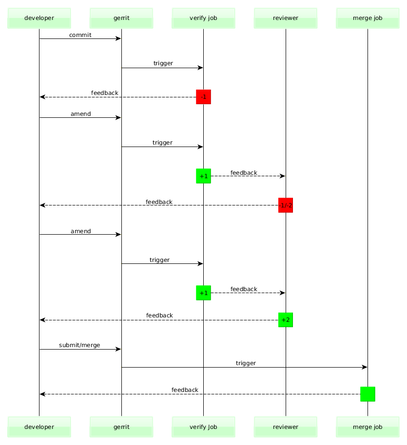
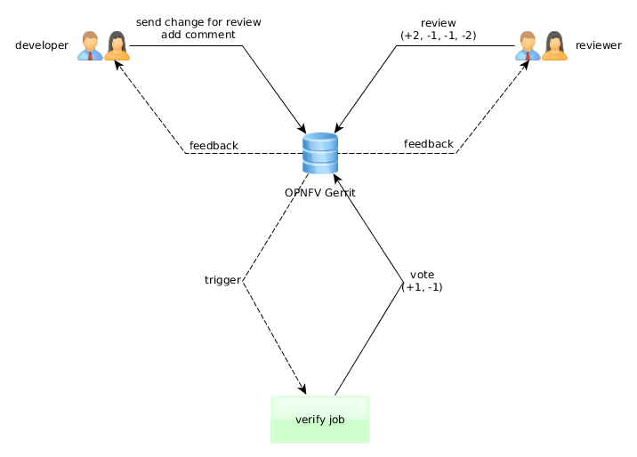
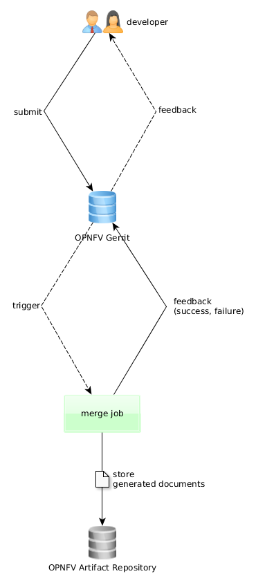
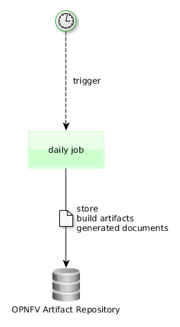

=================
OPNFV CI PIPELINE
=================

OPNFV CI
========

OPNFV Continuous Integration (CI) project provides the starting point for all OPNFV development activities.
It creates a full development environment for OPNFV including automatic build, deployment, and testing.

In order to provide fast and continuous feedback to OPNFV community, CI pipeline utilizes different tools,
runs different type of verification activities in different phases
depending on the needs of different OPNFV projects and the needs of the OPNFV community.

This document aims to provide information regarding OPNFV CI Pipeline
which is currently being enabled for the projects.

CI Pipeline Overview
====================

OPNFV CI Pipeline starts with a change (commit)  and stages in the pipeline
are triggered based on events that happen while the change travels through the pipeline,
producing feedback based on different verification activities.

Below diagram shows overview of the OPNFV CI pipeline.

Please note that the daily job is neglected on above diagram as the daily job
is currently triggered once during night time based on timer, not based on Gerrit events.

Jenkins Jobs in CI Pipeline
===========================

Verify Jenkins Job
------------------

OPNFV CI Pipeline has **verify** jobs for all OPNFV Projects in order to
run quick verification activities for each and every patchset sent to Gerrit for review.

The main purpose of this job is to keep the quality of codebase on certain level
so whoever clones the repo at any given time can get *stable* version of the software.
It also provides feedback regarding the quality of the patchset to developer who submitted the patchset for review,
reviewer(s) who are requested to do review(s) and the rest of the OPNFV community, as early as possible.

This job is triggered automatically when developers issue **git review** command to publish their changes to Gerrit.
Gerrit then publishes **patchset created** event under normal circumstances, triggering the job.
If the job fails to trigger or fails during execution for some reason that is not related to patchset itself,
developers can retrigger it by adding a new comment to change on Gerrit
and include either one of the keywords **recheck** or **reverify**.

The result of this job will be verified/failed vote (+1 or -1) on Gerrit.
Depending on reviews, the commit can later be submitted to master and merged.

This job does not produce any artifact (document, ISO, etc.).

Please check the diagram below to see how the flow looks.

Merge Jenkins Job
-----------------

OPNFV CI Pipeline has **merge** jobs for all OPNFV Projects in order to
run verification activities for each and every change that gets merged to master.

The main purpose of this job is to give feedback regarding the quality of the master branch
once a certain change gets merged to master and the current scope of the job is same as verify job.

This job is triggered automatically by Gerrit **change merged** event under normal circumstances.
If the job fails to trigger or fails during execution for some reason that is not related to patchset itself,
developers can retrigger it by adding a new comment to change on Gerrit and include the keyword **remerge**.

This job currently produces documents and publishes them on `OPNFV Artifact Repository <http://artifacts.opnfv.org/>`_.

Please check the diagram below to see how the flow looks.

Daily Jenkins Job
-----------------

OPNFV CI Pipeline has **daily** jobs for all OPNFV Projects in order to
run more extensive verification activities that can take long time to finish.

The main purpose of this job is to run full build, produce artifacts (installer ISOs, etc.),
store artifacts in OPNFV Artifact Repository so they can be downloaded to target environment,
do the deployment using build artifacts, run tests (Tempest, Robot, etc.)
and give feedback regarding the quality of the master branch.

This job is triggered automatically every night 00:00UTC based on **timer** under normal circumstances.
If the job fails to trigger or fails during execution for some reason that is not related to software itself,
it can only be retriggered by LF aor Octopus team members.

This job produces build artifacts and documents and publishes them on `OPNFV Artifact Repository <http://artifacts.opnfv.org/>`_.

Please check the diagram below to see how the flow looks.

