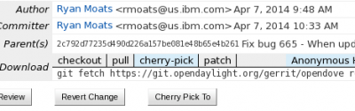
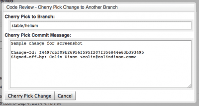

=============
Stable Branch
=============

Overview of Stable Branch Handling
----------------------------------

The stable branch is intended to be a safe source of fixes for high impact bugs and security issues
which have been fixed on master since a given release.
It allows users of release (stable) versions to benefit from the ongoing bugfix work after the release.

Official point releases for each project are published from the branch on a per need basis, as decided by the TSC.
In later stages, a regular cadence for point releases may be introduced.

It's possible to check current maintained versions in the releases page.

OPNFV's stable branch policy borrows much from prior art, in particular from OpenStack
and OpenDaylight.

In general all fixes should be made on the main branch and cherry picked to stable.
If there is a case where the fix is not able to be merged backwards
only then we would need to do any work directly on stable.
The documented method for getting a fix into stable should be by a **cherry-pick process**.

Stable branch policy
--------------------

Appropriate fixes
~~~~~~~~~~~~~~~~~

Only a limited class of changes are appropriate for inclusion on the stable branch.

A number of factors must be weighed when considering a change:

- **The risk of regression** - even the tiniest changes carry some risk of
  breaking something and we really want to avoid regressions on the stable branch
- **The user visible benefit** - are we fixing something that users might actually
  notice and, if so, how important is it?
- **How self-contained the fix is** - if it fixes a significant issue but also
  refactors a lot of code, it's probably worth thinking about what a less risky
  fix might look like
- Whether the fix is **already on master** - a change must be a **backport** of a change
  already merged onto master, unless the change simply does not make sense on master
  (e.g. because of a change of architecture).
- If there is a suitable **work-around** for a bug, normally there won't be a fix on stable.
- Since OPNFV is a midstream integration effort, also **test cases** might be suitable backports
  in case they are related to critical bugs found in stable.

Some types of changes are completely forbidden:

- New features
- Changes to the external APIs
- Changes to the notification definitions
- DB schema changes
- Incompatible config file changes
- Changes including a version upgrade of an upstream component of OPNFV
  (since this will typically violate the above points)

Support phases
~~~~~~~~~~~~~~

Support phases will be introduced at a later time

Review of fixes
~~~~~~~~~~~~~~~

Each backported commit proposed to gerrit should be reviewed and +2ed by committer(s) of the
corresponding projects.

If unsure about the technical details of a given fix, contributors should consult with
the committers from the affected projects for a more detailed technical review.

If unsure if a fix is appropriate for the stable branch, at this time the TSC will do the final decision.

Security fixes
~~~~~~~~~~~~~~

Fixes for embargoed security issues receive special treatment.
These should be reviewed in advance of disclosure by committers.
At the time of coordinated public disclosure,
the fix is proposed simultaneously to master and the stable branches and immediately approved.

Processes
---------

Proposing fixes
~~~~~~~~~~~~~~~

Anyone can propose a cherry-pick to the project committers.

One way is that if a bugfix on master looks like a good candidate for backporting
- e.g. if it's a significant bug with the revious release - then just nominating the bug
for the maintenance will bring it to the attention of the maintainers.

If you don't have the appropriate permissions to nominate the bug, then send an email via the user list.

The best way to get the patch merged in timely manner is to send it backported by yourself.
To do so, you may try to use "Cherry Pick To" button in Gerrit UI for the original patch in master.
Gerrit will take care of creating a new review, modifying commit message to include 'cherry-picked from ...' line etc.

If the patch you're proposing will not cherry-pick cleanly,
you can help by resolving the conflicts yourself and proposing the resulting patch.
Please keep Conflicts lines in the commit message to help reviewers!
You can use git-review to propose a change to the stable branch with:

**Cherry Pick Patches from Master to a Stability Branch From Command Line**::

   $> git checkout stable/arno
   $> git cherry-pick -x $master_commit_d
   $> git review stable/arno

Note: cherry-pick -x option includes 'cherry-picked from ...' line
in the commit message which is required to avoid Gerrit bug

**Cherry Pick Patches from Master to a Stability Branch via Gerrit UI**

1. Select the patch that you want to cherry pick from Master to Stable Branch
2. Locate the Cherry Pick To button

3. Start to type in "re" in the branch text box to get suggestions to appear, then select "refs/heads/stable/<release-name>"

.. image:: images/stability_screenshot10.png
   :scale: 100%

4. Click Cherry Pick Change

Failing all that, just ping one of the team and mention that you think the bug/commit is a good candidate.

Change-Ids
~~~~~~~~~~

When cherry-picking a commit, keep the original Change-Id and gerrit will
show a separate review for the stable branch
while still allowing you to use the Change-Id to see all the reviews associated with it.

Hint: Change-Id line must be in the last paragraph. Conflicts in the backport: add a new paragraph,
creating a new Change-Id but you can avoid that by moving conflicts
above the paragraph with Change-Id line or removing empty lines to make a single paragraph.

Email Notifications
~~~~~~~~~~~~~~~~~~~

If you want to be notified of these patches you can create a watch on this screen:
https://gerrit.opnfv.org/gerrit/#/settings/projects
click "Watched Projects"

Project Name: All-Projects

Only If: branch:<stable branch of your choice>

Then check the "Email Notifications - New Changes" checkbox.
That will cause gerrit to send an email whenever a matching change is proposed,
and better yet, the change shows up in your 'watched changes' list in gerrit.

Bug Tags
~~~~~~~~

will be introduced when we see the need.

CI Pipeline
~~~~~~~~~~~

Octopus team will setup separate pipeline for stable branches.

Stable Branch Maintenance Team organization
-------------------------------------------

TBD.

References
----------

https://wiki.openstack.org/wiki/StableBranch

https://wiki.opendaylight.org/view/Simultaneous_Release:Cutting_Stability_Branches

