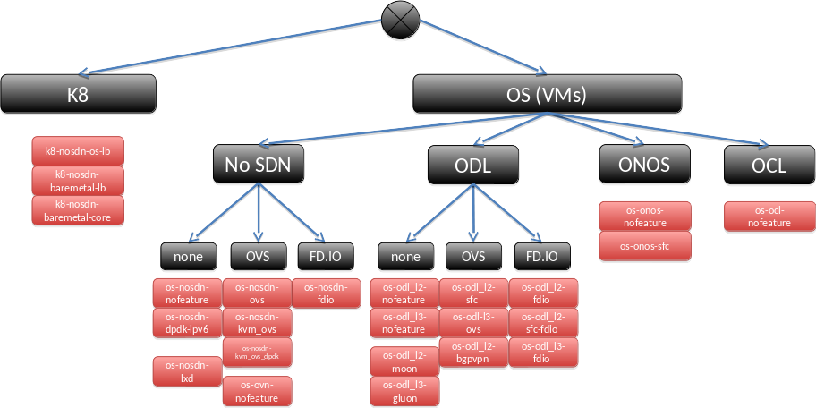
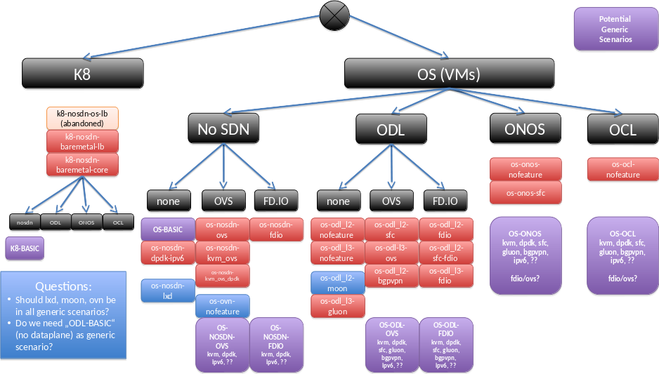

.. This work is licensed under a Creative Commons Attribution 4.0 International License.
.. http://creativecommons.org/licenses/by/4.0
.. (c) 2017 OPNFV Ulrich Kleber (Huawei)

Current Status
---------------

tdb: this chapter will summarize the scenario analysis.

Arno
^^^^^^^^

In Arno release, the scenario concept was not created yet.
Looking back, we can say we had one scenario with OpenStack, ODL and KVM,
that could be deployed in two ways, by the two installers available in Arno.

Brahmaputra
^^^^^^^^^^^^^^^^

tbd

Colorado
^^^^^^^^^^^^

tbd

Danube
^^^^^^^^^^

tbd: Analysis of the 58 scenarios
The analysis can be found in the slides at
https://wiki.opnfv.org/display/INF/Scenario+Consolidation
and will be explain with some text here.
The text will also use the diagrams from the slides, e.g.
show a scenario tree:

and an idea about possible generic scenarios:

as well as possible ways to reach this.

